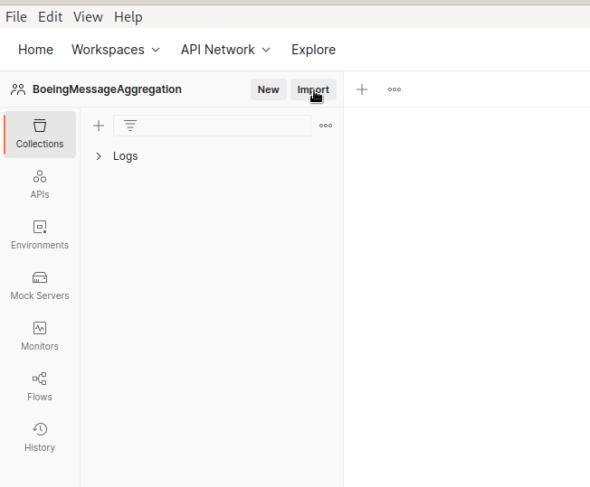
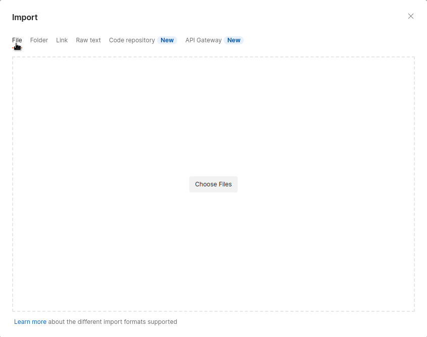
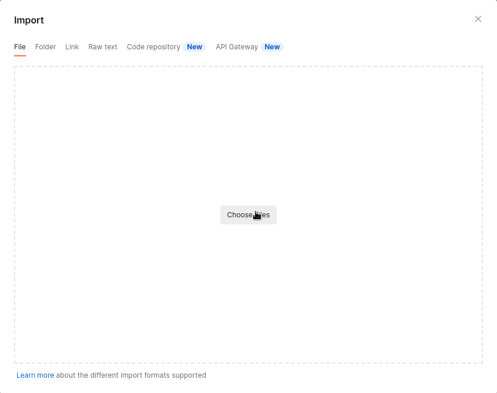
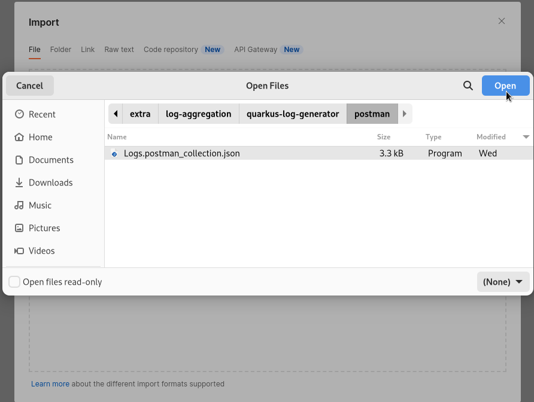
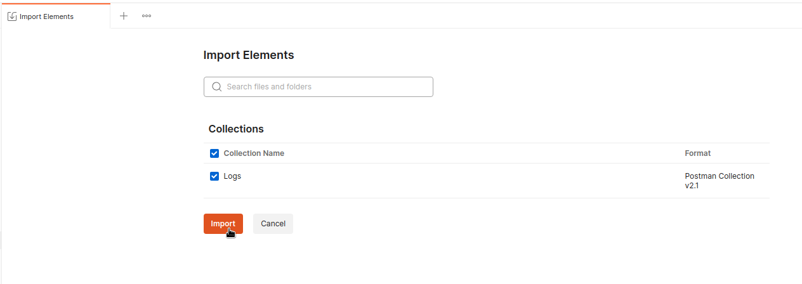
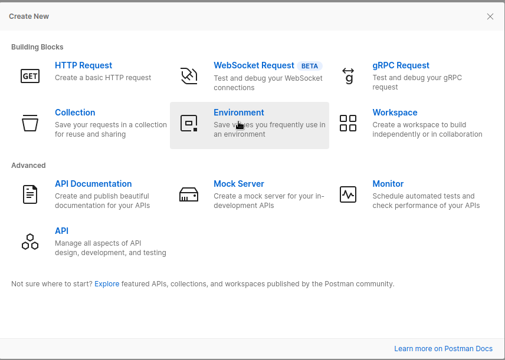
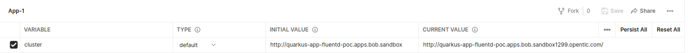
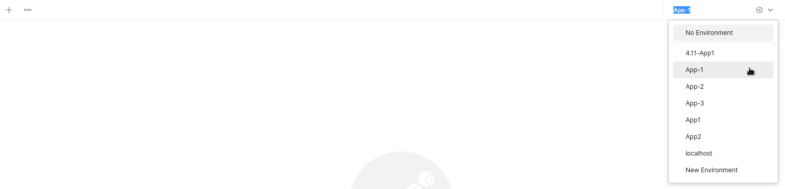
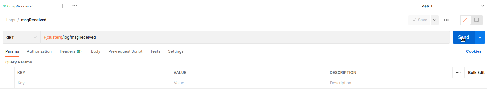

== Quarkus Log Generator

This is a Quarkus application that provides various REST endpoints for
generating sample logs.

=== Endpoints

GET /log This endpoint logs a test message with the text "`001 - Test`".

GET /log/msgReceived This endpoint logs a message with the text "`INFO 1
— [XNIO-2 task-2] receiveMessage : Received message: D0348A.MAH003.IN3.
3099024`".

GET /log/msgSent This endpoint logs a message with the text "`INFO 1 —
[XNIO-2 task-2] sendMessage : Send message: D0348A.MAH003.IN3.
3099024`".

GET /log/msgStored This endpoint logs a message with the text "`INFO 1 —
[XNIO-2 task-1] c.b.dif.centralrouter.MessageRepository : Stored message
CORRID: D0348A.MAH013.IN3. 3098678`".

GET /log/fileReceived This endpoint logs a message with the text "`INFO
1 — [Camel (CentralRouter) thread #2 - file:///difrouter/desbs/stg/in/]
DeployedToCentralFileRoute : Filename Read:
/difrouter/desbs/stg/in/D0348A_DATAGR_N0931A_003204_20221020113002.zip`".

GET /log/fileSent This endpoint logs a message with the text "`INFO 1 —
[Camel (CentralRouter) thread #2 - file:///difrouter/desbs/stg/in/]
DeployedToCentralFileRoute : Filename Written:
/difrouter/dif/out/D0348A_DATAGR_N0931A_003204_20221020113002.zip`".

GET /log/dupError This endpoint logs an error message with the text
"`ERROR 1 — [XNIO-2 task-1] removeDuplicateMessages : Duplicate message
ignored, CORRID: A2971A.CA320A.IN4. 3251661`".

POST /log/loop/\{num} This endpoint logs a message a number of times
equal to num, where num is a path parameter specified by the client. It
returns the text "`INFO 1 — [XNIO-2 task-2] receiveMessage : Received
message: D0348A.MAH003.IN3. 3099024`".

=== Dependencies

This application uses the following dependencies:

Quarkus - a Java framework for building cloud-native applications. JBoss
Logging - a logging library for the Java Virtual Machine. Jakarta
RESTful Web Services (JAX-RS) - a Java API for creating RESTful web
services.

=== How to deploy

Login to OCP: `+oc login --token=myToken --server=myServerUrl+`

Run a Quarkus Build:
`+quarkus build -Dquarkus.kubernetes-client.master-url=myServerUrl -Dquarkus.kubernetes-client.token=myToken+`

Deploy to OCP: `+quarkus build -Dquarkus.kubernetes.deploy=true+`

Get New Service Name: `+oc get svc+`

Expose Service: `+oc expose svc/[Service Name]+`

=== How to deploy additional apps via ImageStream

Get the Imagestream: `+oc get is+`

Deploy new app:
`+oc new-app --name=[New App Name] [project]/[Image Stream Name]:[TAG]+`

=== Import Postman Collection

You can download the latest Postman version
https://www.postman.com/downloads/[here] or you can use the web client
https://www.postman.com/[here]

Click on the Import button in the top left corner of the app window.

In the new window, click on the File tab.

Click on the Choose files option.

Select the postman/Logs.postman_collection.json file

Ensure Logs is selected and click Import.

=== Using Postman Collection

Create a new environment with a variable named `+cluster+`

Set `+cluster+` equal to your cluster address

Select the new environment in the top right dropdown menu

Choose a request to execute within the Logs collection and click Send

